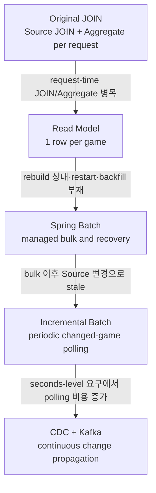
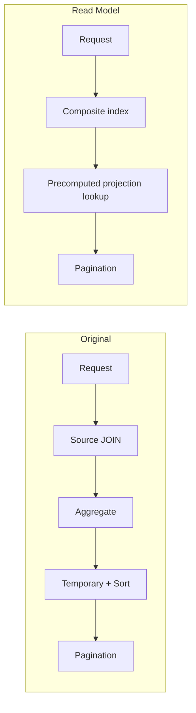
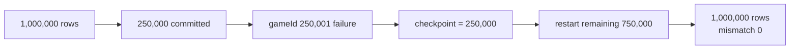
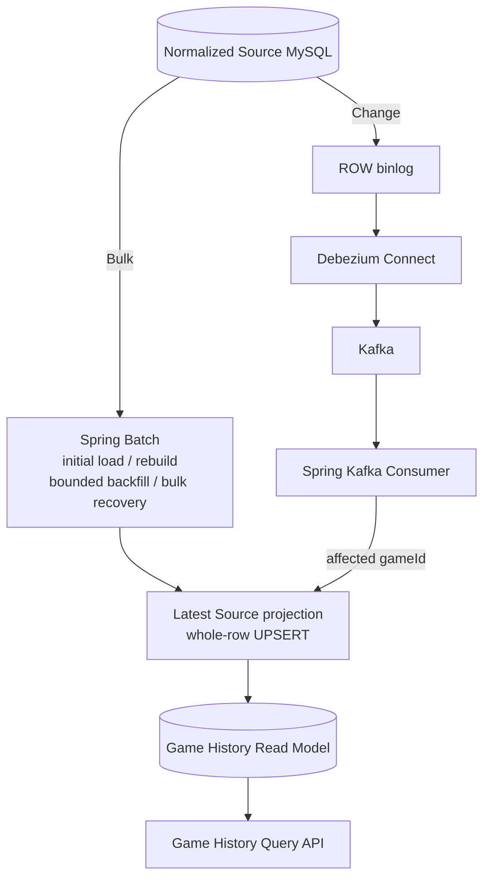

# Game History Read Model Lab

대량 게임 이력 조회에서 매 요청마다 수행되는 JOIN/Aggregate 병목을 1M game 데이터로 재현하고, game당 1-row Read Model로 계산 시점을 옮긴 프로젝트입니다. Read Model이 만든 bulk 생성·실패 복구·freshness 문제를 실제 실패 실험과 측정으로 확인한 뒤 Spring Batch, Incremental Batch, CDC + Kafka를 필요한 지점에만 추가했습니다. 최종적으로 **Query는 Read Model, Bulk는 Spring Batch, 지속 변경은 CDC + Kafka**로 책임을 분리했습니다.

> 모든 성능 수치는 Apple M1 8-core/16GB의 로컬 Docker 환경에서 얻은 비교 실험 결과입니다. 운영 환경의 처리량이나 보편적인 아키텍처 규칙으로 일반화하지 않습니다.

## Architecture Evolution

처음부터 아래 구조를 정답으로 정한 것이 아닙니다. 각 단계에서 직전 구조의 한계를 측정하거나 직접 실패시킨 뒤 다음 실험을 선택했습니다.



## Decision / Evidence

| 문제 | 선택 | 선택 근거 | 결과 |
| --- | --- | --- | --- |
| 넓은 기간을 조회할 때마다 child JOIN/Aggregate 반복 | game당 1-row Read Model | Stage 2 same-run Original 3개월 page 0 p95 6.25–10.86s, 289,842 rows read | Read Model p95 6.96–10.49ms, 20 rows read |
| projection full rebuild의 상태와 실패 위치를 알 수 없음 | Spring Batch + JDBC JobRepository + 1,000-row chunk | game 250,001에서 강제 실패 후 250,000 rows만 commit | checkpoint에서 남은 750,000 rows restart, 최종 mismatch 0 |
| bulk 완료 후 Source 변경으로 Read Model이 stale | `(updated_at, game_id)` cursor 기반 Incremental Batch | 5–10분 cadence에서 affected game만 처리하고 correctness 유지 | 수분 단위 freshness에는 더 단순한 선택으로 충분 |
| 정상 상황 수 초 이내 반영 요구 | MySQL binlog CDC + Kafka consumer | 1분 polling은 60회 중 41.7% empty, MySQL Questions 16,537 | CDC p95 450ms, max 468ms, missing 0 |

## Problem

정규화된 `Game → Round → RoundScore` Source는 변경을 저장하기에는 자연스럽지만, 게임 이력 API가 `totalScore`와 `roundCount`를 만들려면 요청마다 child table을 JOIN하고 집계해야 합니다. 데이터가 커질수록 최종 반환 row 수와 무관한 계산이 반복됩니다.

이 저장소는 실무에서 접한 문제를 회사 내부 데이터나 구조 없이 작은 로컬 환경에 재현한 실험입니다. 목적은 기술을 많이 사용하는 것이 아니라 **문제를 먼저 확인하고, 그 문제를 해결하는 만큼만 복잡성을 추가하는 것**입니다.

대표 API 계약은 모든 단계에서 동일하게 유지했습니다.

```http
GET /shops/{shopId}/games?from={from}&to={to}&page={page}&size={size}
```

- 기간: `[from, to)`
- 정렬: `playedAt DESC, gameId DESC`
- 결과: `gameId`, `shopId`, `playedAt`, `playerNickname`, `courseName`, `totalScore`, `roundCount`, `gameStatus`

## Experiments at a Glance

### 1. Original JOIN — 병목 재현

- **Problem:** 요청마다 `games`, `rounds`, `round_scores`를 JOIN하고 집계·정렬했습니다.
- **Evidence:** 1M games / 3.6M rounds / 6.9M scores에서 3개월 p95는 page 0 4.69–6.42s, page 100 6.78–7.53s였습니다. page 0은 177,689 joined rows를 집계했고, 20 rows 반환에 289,842 rows를 읽었습니다. `Using temporary; Using filesort`도 확인했습니다.
- **Decision:** Source query를 먼저 튜닝하지 않고 request-time 계산을 제거하는 Read Model을 검토했습니다.

[Stage 1 실험 상세](docs/experiments/stage1-original-join.md)

### 2. Read Model — 요청 경로에서 계산 제거

- **Problem:** 조회 범위가 넓어질수록 같은 JOIN/Aggregate가 반복됐습니다.
- **Decision:** API에 필요한 값을 game당 1 row로 미리 계산하고 `(shop_id, played_at DESC, game_id DESC)` index로 조회했습니다.
- **Evidence:** request path가 네 table JOIN/Aggregate에서 단일 ordered range scan으로 바뀌었고, 3개월 page 0은 289,842 rows read에서 20 rows read로 줄었습니다.

[Stage 2 실험 상세](docs/experiments/stage2-read-model.md)

### 3. Spring Batch — bulk 처리와 복구 관리

- **Problem:** `TRUNCATE → INSERT ... SELECT` baseline에는 실행 상태, 실패 위치, checkpoint, bounded backfill이 없었습니다.
- **Decision:** JDBC JobRepository와 1,000-row chunk transaction을 사용한 최소 Batch job을 추가했습니다.
- **Evidence:** 250,001에서 실패한 뒤 같은 JobInstance가 checkpoint 250,000부터 재시작했고, 10,000-row bounded backfill도 대상 밖 row를 바꾸지 않았습니다.

[Stage 3 실험 상세](docs/experiments/stage3-batch-recovery.md)

### 4. Incremental Batch — 수분 단위 freshness 검증

- **Problem:** bulk job 직후의 신규·상태·점수 변경은 Read Model에 자동 반영되지 않았습니다.
- **Decision:** 세 Source table의 `(updated_at, game_id)` cursor와 5분 overlap으로 affected game만 다시 계산했습니다.
- **Evidence:** boundary, replay, failure/restart에서 최종 projection이 일치했고, sparse workload의 5–10분 freshness에는 충분했습니다. 1분 cadence에서는 empty run과 고정 polling 비용이 두드러졌습니다.

[Stage 4 실험 상세](docs/experiments/stage4-incremental-freshness.md)

### 5. CDC + Kafka — seconds-level 변경 반영

- **Problem:** 새로 가정한 정상 상황 수 초 이내 요구에는 periodic polling의 대기와 빈 실행 비용이 맞지 않았습니다.
- **Decision:** MySQL ROW binlog를 Debezium과 Kafka로 전달하고, consumer가 affected game의 최신 projection을 UPSERT하도록 했습니다.
- **Evidence:** 20개 순차 변경에서 p50 395ms / p95 450ms / max 468ms / missing 0이었고, replay와 consumer restart 후에도 최종 Source와 수렴했습니다.

[Stage 5 실험 상세](docs/experiments/stage5-cdc-kafka.md)

## Read Model: Why the Query Became Cheaper

Stage 2에서는 같은 jar와 DB에서 Original과 Read Model을 각각 두 pass로 비교했습니다. 아래 값은 popular shop의 3개월 page 0 결과입니다.

| Path | p95 pass 1 / pass 2 | Throughput pass 1 / pass 2 | Rows read/request |
| --- | ---: | ---: | ---: |
| Original JOIN | 10,861.08 / 6,245.20ms | 0.593 / 0.796 req/s | 289,842 |
| Read Model | 10.49 / 6.96ms | 636.39 / 914.21 req/s | 20 |



개선의 핵심은 query rewrite가 아니라 계산 시점의 이동입니다. `SUM(score)`와 `COUNT(DISTINCT round)`를 요청마다 만들지 않고 projection 생성·갱신 시점에 계산했습니다. page 100에서는 offset traversal이 남지만 child-row multiplication과 request-time aggregate는 제거됩니다.

## Spring Batch: Recovery, Not Query Optimization



이 프로젝트에서 Spring Batch의 가치는 `execution state`, chunk transaction, checkpoint, restart, bounded backfill입니다. Simple SQL과 Batch의 처리 시간은 통제된 성능 비교가 아니므로 Spring Batch가 더 빠르다고 결론내리지 않았습니다. 또한 Batch restart는 atomic publication이나 지속적인 freshness를 자동으로 해결하지 않습니다.

## From Incremental Batch to CDC

바로 Kafka를 도입하지 않고, sparse eight-game workload를 한 시간의 logical timeline에서 먼저 polling했습니다.

| Cadence | Freshness lag range | Executions | Selected rows (overlap replay 포함) | MySQL Questions | Empty runs |
| --- | ---: | ---: | ---: | ---: | ---: |
| 10분 | 61.333–599.351s | 6 | 17 | 1,660 | 0/6 |
| 5분 | 59.535–299.323s | 12 | 29 | 3,330 | 2/12 (16.7%) |
| 1분 | 59.254–59.395s | 60 | 90 | 16,537 | 25/60 (41.7%) |

Stage 4의 freshness는 실제 한 시간을 기다린 분포가 아니라 `다음 logical tick까지의 wait + 실제 job duration`입니다. 이 실험에서는 5–10분 요구라면 Incremental Batch가 충분하고 더 단순했습니다. 정상 상황 수 초 이내라는 요구가 추가되자 더 짧은 polling 대신 CDC의 지속 운영 비용을 받아들일 근거가 생겼습니다.

| Stage 5 local samples | p50 | p95 | max | Missing/error |
| ---: | ---: | ---: | ---: | ---: |
| 20 | 395ms | 450ms | 468ms | 0 |

CDC는 periodic change-discovery query를 제거했지만 Source 비용을 0으로 만들지는 않습니다. MySQL은 binlog와 replication connection을 유지하고, consumer는 record마다 최신 Source projection을 다시 조회합니다. Stage 4의 1시간 logical counter와 Stage 5의 10초 real idle counter는 동등한 부하 시험이 아니므로 절대량을 직접 비교하지 않았습니다.

## Final Architecture



- **Query = Read Model:** 동일 API 계약을 단일 table의 ordered index lookup으로 제공합니다.
- **Bulk = Spring Batch:** initial load, rebuild, bounded backfill, bulk recovery를 담당합니다.
- **Change = CDC + Kafka:** Batch-to-CDC handoff 이후 신규·수정 변경을 지속적으로 전달합니다.

Batch와 CDC는 경쟁 기술이 아닙니다. 하나는 많은 projection을 만들고 복구하며, 다른 하나는 이후의 작은 변경 흐름을 전달합니다.

## CDC Consumer: Event as a Trigger

```text
CDC record
→ affected gameId 식별
→ 최신 Source Game/Round/RoundScore 재조회
→ 기존 projection 계산
→ whole-row UPSERT
→ listener 성공 후 offset commit
```

CDC payload를 Read Model row로 직접 변환하지 않았습니다. Stage 4 Incremental Batch와 CDC consumer가 같은 projection updater를 사용하므로 transport와 무관하게 row 의미가 같습니다. 중복 전달 시에도 최신 Source 상태를 다시 UPSERT해 수렴하고, CDC payload format과 projection schema의 결합도 줄였습니다. 이는 현재의 latest-state projection에 맞춘 선택이며 모든 CDC 시스템의 정답을 의미하지 않습니다.

DB transaction과 Kafka offset은 원자적으로 commit되지 않습니다. DB commit 뒤 offset commit 전에 실패하면 record가 replay될 수 있으며, 이 프로젝트는 exactly-once가 아니라 idempotent UPSERT를 통한 at-least-once convergence를 검증했습니다.

## Failure / Recovery Evidence

| Failure | Recovery | Result |
| --- | --- | --- |
| Simple rebuild 중 SQL 중단 | 전체 rebuild 재실행 | 실패 직후 Read Model 0 rows; 재실행 후 1M equality |
| Spring Batch game 250,001 failure | checkpoint 250,000에서 같은 JobInstance restart | 남은 750,000 처리, mismatch 0 |
| Incremental Batch partial failure | durable cursor를 전진시키지 않고 restart | 남은 변경 처리 후 workload mismatch 0 |
| Incremental replay | latest Source projection UPSERT | checksum `15319432641` 전후 동일 |
| Kafka earliest replay | 31 records 재처리 | checksum `3287816278` 전후 동일, lag 0 |
| Consumer UPSERT 후 listener failure | JDBC rollback 후 같은 group 수동 restart/redelivery | offset 25→26, lag 1→0, 최종 수렴 |

실행하지 않은 broker outage, poison-message loop, atomic rebuild publication은 성공한 장애 실험처럼 주장하지 않습니다.

## Final Decision

이 프로젝트의 workload와 로컬 실험 환경에서는 다음 기준이 적합했습니다.

| Requirement | Choice | Reason |
| --- | --- | --- |
| 조회 | Read Model | request-time JOIN/Aggregate 제거 |
| initial load / rebuild / bounded repair / bulk recovery | Spring Batch | durable state, chunk checkpoint, restart |
| 5–10분 변경 반영 | Incremental Batch | affected game만 처리하며 더 단순한 운영 구조 |
| 정상 상황 seconds-level 변경 반영 | CDC + Kafka | periodic polling 없이 local p95 450ms |

따라서 결론은 “Kafka를 선택했다”가 아니라 **seconds-level 요구가 생겼을 때 Kafka/Connect의 추가 infrastructure와 운영 복잡성을 감수할 가치가 있었다**는 것입니다. 5–10분 freshness가 허용된다면 Incremental Batch가 여전히 더 단순한 선택입니다.

## Trade-offs and Remaining Problems

- **Batch → CDC handoff gap:** `snapshot.mode=no_data`이므로 initial load 완료와 connector 시작 위치를 잘못 조율하면 변경을 놓칠 수 있습니다.
- **Delete / re-parent semantics:** 현재 Source에는 합의된 delete/soft-delete 또는 round 이동 계약이 없습니다.
- **Poison message / retry / DLQ:** 기본 consumer failure는 listener container를 멈추며 수동 restart가 필요합니다.
- **Atomic rebuild publication:** 최초 적재와 chunk rebuild는 하나의 완전한 version으로 원자 공개되지 않습니다.
- **Local Kafka/Connect persistence:** container recreation 시 broker record와 offset이 유지되지 않습니다.

이 문제들은 중요하지 않아서 숨긴 것이 아니라, 현재 실험 질문에 필요하지 않은 Snapshot + Catch-up, versioned Read Model, retry/DLQ 같은 복잡성을 미리 추가하지 않았기 때문에 남겨 둔 경계입니다. 영향과 다음 실험 조건은 [Final Technical Comparison](docs/final-comparison.md#remaining-problems)에 정리했습니다.

## Tech Stack

| Area | Technology | Role |
| --- | --- | --- |
| Language / Runtime | Kotlin 2.3.21, Java 21 | Java/Spring 개발자가 읽기 쉬운 Kotlin application |
| Framework | Spring Boot 4.1.0, Spring MVC | blocking Game History API와 application lifecycle |
| Data access | Spring JDBC | 명시적인 JOIN/Aggregate 및 projection SQL |
| Database | MySQL 8.4 | normalized Source, Read Model, Batch metadata, ROW binlog |
| Bulk processing | Spring Batch 6.0.4 | chunk transaction, JobRepository, checkpoint, restart |
| CDC / Messaging | Debezium Connect 3.4.3.Final, Kafka 4.1.1, Spring Kafka | binlog change transport와 consumer offset 관리 |
| Load test | k6 2.0.0 | Stage 1–2 반복 HTTP benchmark |
| Infrastructure | Docker Compose | local MySQL, single Kafka broker, Connect worker |
| Testing | JUnit 5, Testcontainers MySQL | 실제 MySQL semantics 기반 integration test |
| Build | Gradle Wrapper 9.5.1, Kotlin DSL | 재현 가능한 build entrypoint |

## Reproduction

### Prerequisites

- Java 21
- Docker with Docker Compose
- `curl`
- Stage 5 setup: `jq`
- Stage 1–2 HTTP benchmark 재실행: k6 2.0.0

System Gradle은 필요하지 않습니다. Gradle Wrapper를 사용합니다.

### Quick verification

Docker가 실행 중인 상태에서 Compose 설정, build, Testcontainers 기반 integration test를 검증합니다.

```bash
./scripts/verify.sh
```

### Local API with the 1M dataset

아래 seed 명령은 기존 Source 데이터를 교체하며 1M games와 child rows를 적재하므로 시간이 걸리고 디스크를 사용합니다.

```bash
docker compose up -d --wait mysql
./scripts/generate-stage1-data.sh --reset
./scripts/rebuild-stage2-read-model.sh
./gradlew bootRun
```

다른 terminal에서 기본 Read Model 경로를 호출합니다.

```bash
curl 'http://localhost:8080/shops/1/games?from=2025-10-01T00%3A00%3A00Z&to=2026-01-01T00%3A00%3A00Z&page=0&size=20'
```

Original baseline은 같은 API에 `queryMode=original`을 추가해 비교할 수 있습니다. 종료할 때 `docker compose down`을 사용하며 MySQL volume은 유지됩니다.

### Full experiments

전체 실험은 1M dataset을 전제로 하고 local DB/Read Model/workload를 변경하며, 새 result directory를 생성합니다. HTTP benchmark는 application이 `localhost:8080`에서 실행 중이어야 합니다. Stage 3–5 runner의 환경 metadata 수집은 실험을 수행한 macOS host의 `system_profiler`를 사용하므로 다른 OS에서는 해당 부분을 조정해야 합니다.

| Experiment | Command | Additional requirement / effect |
| --- | --- | --- |
| Original JOIN vs Read Model | `./scripts/run-stage2-benchmark.sh` | k6, curl, jq; 현재 API에서 `queryMode=original`과 `read-model`을 명시해 교차 측정 |
| Stage 3 Batch recovery | `./scripts/run-stage3-experiment.sh <unique-result-id>` | failure injection과 rebuild/backfill로 Read Model 변경 |
| Stage 4 Incremental freshness | `./scripts/run-stage4-experiment.sh <unique-result-id>` | logical cadence workload와 failure/replay 실행 |
| Stage 5 CDC + Kafka | `./scripts/prepare-stage5-cdc.sh`<br/>`./scripts/run-stage5-experiment.sh <unique-result-id>` | Kafka/Connect 기동, real CDC workload 실행 |

Stage 1 retained run은 당시 Original이 기본 API 경로였을 때 생성됐습니다. 현재 기본값은 Read Model이고 과거 `run-stage1-benchmark.sh`는 `queryMode=original`을 명시하지 않으므로, 현재 Original 재현 명령으로 안내하지 않습니다. 현재의 공정한 HTTP 비교 entrypoint는 두 mode를 명시하는 Stage 2 runner입니다. 각 experiment의 정확한 전제, 측정 방식, retained raw evidence는 아래 문서를 먼저 확인하세요.

## Detailed Evidence

- [Final Technical Comparison](docs/final-comparison.md) — Stage 간 인과관계, 조건부 선택 기준, 최종 책임 분리와 evidence boundary
- [Stage 1 — Original JOIN](docs/experiments/stage1-original-join.md) — dataset, HTTP baseline, rows read, `EXPLAIN ANALYZE`
- [Stage 2 — Read Model](docs/experiments/stage2-read-model.md) — 동일 API correctness, Original/Read Model 교차 측정, execution plan
- [Stage 3 — Batch Recovery](docs/experiments/stage3-batch-recovery.md) — game 250,001 failure, checkpoint/restart, bounded backfill
- [Stage 4 — Incremental Freshness](docs/experiments/stage4-incremental-freshness.md) — cadence별 freshness/cost, tuple boundary, failure/replay
- [Stage 5 — CDC + Kafka](docs/experiments/stage5-cdc-kafka.md) — actual MySQL→Debezium→Kafka flow, freshness, offset/replay/restart

Raw 및 summarized artifact는 각 문서가 가리키는 `benchmarks/stageN/results/...` 아래에 보존되어 있습니다.
