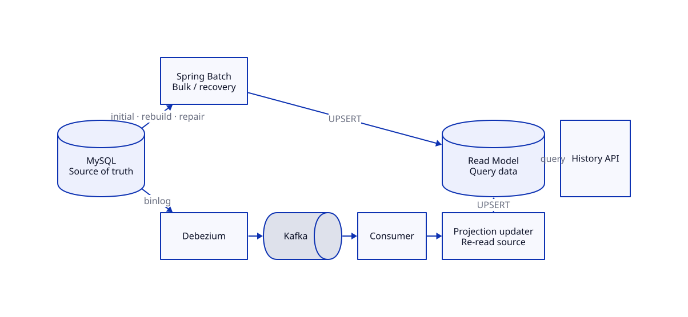

# Game History Read Model Lab

[](https://github.com/winkrj/game-history-lab/actions/workflows/verify.yml)

게임 이력 조회를 10초대에서 10ms 안팎으로 줄인 뒤, 조회 전용 데이터를 **안정적으로 생성·복구·동기화하는 방법**을 100만 건 데이터로 검증했습니다.

`Kotlin` · `Spring Boot` · `MySQL` · `Spring Batch` · `Debezium` · `Kafka`

## 배경

게임 이력 한 페이지를 만들려면 `games`, `rounds`, `round_scores`를 매번 조인하고 집계해야 했습니다. 게임 수가 100만 건까지 늘어나자 대표 3개월 조회에 6~10초가 걸렸습니다.

게임 한 건의 조회 결과를 한 행에 미리 저장하는 조회 전용 테이블(Read Model)을 도입해 조회 경로를 단순화했습니다.

| 3개월 조회 | 기존 조인·집계 | 조회 전용 테이블 |
| --- | ---: | ---: |
| p95 | 6.2~10.8초 | 6.96~10.49ms |
| 요청당 읽은 행 | 289,842 | 20 |

조회 병목은 사라졌습니다. 이후의 과제는 쿼리가 아니라, 미리 계산된 데이터를 운영하는 일이었습니다.

## 문제 정의

당시 조회 전용 테이블을 만드는 방법은 `TRUNCATE → INSERT SELECT` 한 번뿐이었습니다. 작업을 중간에 실패시켜 보니 한계가 분명했습니다.

- 테이블이 0건인 상태로 남았다.
- 어디까지 처리했는지 기록이 없어 100만 건을 처음부터 다시 만들어야 했다.
- 잘못된 일부 데이터만 골라서 다시 만들 수 없었다.
- 작업이 끝난 뒤 원본이 바뀌어도 조회 결과는 그대로였다.

목표는 네 가지였습니다. **작업 상태를 남기고, 실패 지점부터 재시작하고, 필요한 범위만 복구하고, 이후의 변경을 수 초 안에 반영하는 것.**

## 결론

대량 데이터를 만드는 일과 이후의 변경을 전달하는 일은 성격이 달랐습니다. Spring Batch와 CDC + Kafka를 경쟁 관계로 두지 않고 각자 잘하는 역할을 맡겼습니다.



- **Spring Batch** — 최초 생성, 전체 재생성, 부분 복구
- **Debezium + Kafka** — 원본 변경 감지와 전달
- **Projection Updater** — 최신 원본을 다시 읽어 조회용 데이터 갱신
- **Read Model** — API가 사용하는 조회 전용 데이터

검증 결과는 다음과 같습니다.

| 상황 | 결과 |
| --- | --- |
| 100만 건 처리 중 강제 중단 | 250,000건 이후부터 재시작, 최종 차이 0건 |
| 10,000건 부분 재처리 | 대상 밖 990,000건 변경 없음 |
| 원본 변경 반영 | p95 450ms, 최대 468ms, 누락 0건 |
| 같은 이벤트 재처리 | 전체 결과 동일, 미처리 이벤트 0건 |

## 과정

### 1. 재생성 작업에 복구 지점을 남겼다

기존 SQL은 단순했지만 작업 상태를 기억하지 못했습니다. Spring Batch를 선택한 이유는 처리 속도가 아니라 JobRepository와 chunk checkpoint를 이용한 **복구 가능성**이었습니다.

100만 건 가운데 250,001번째 게임에서 강제로 실패시켰습니다. 앞서 처리한 250,000건과 체크포인트가 남았고, 같은 작업을 재시작하자 나머지 750,000건만 처리했습니다. 범위를 지정한 작업에서는 10,000건만 다시 만들고 나머지 990,000건은 그대로 유지했습니다.

### 2. Kafka를 넣기 전에 주기 작업부터 확인했다

변경이 드문 환경이라면 원본을 일정한 간격으로 확인하는 방식이 더 단순합니다. 한 시간 동안 게임 8건이 변경되는 상황을 재현해 실행 주기를 비교했습니다.

| 실행 주기 | 반영 지연 | 변경 없이 실행 | DB 요청 수 |
| --- | ---: | ---: | ---: |
| 10분 | 61~599초 | 0/6 | 1,660 |
| 5분 | 59~299초 | 2/12 | 3,330 |
| 1분 | 약 59초 | 25/60 | 16,537 |

5~10분 안에 반영하면 되는 조건에서는 주기 작업으로 충분했습니다. 반면 수 초 단위 반영을 위해 실행 간격을 줄이자, 변경이 없어도 DB를 확인하는 작업이 빠르게 늘었습니다. 이 지점에서 Debezium과 Kafka를 선택했습니다.

### 3. 이벤트는 신호로만 사용했다

조회 결과는 세 테이블의 데이터로 만들어집니다. 변경 이벤트의 값만 조합하면 테이블별 이벤트 순서와 형식이 계산 로직에 스며듭니다.

Consumer는 이벤트에서 `gameId`만 찾습니다. 이후 원본 DB에서 해당 게임의 현재 상태를 다시 읽고 한 행 전체를 갱신합니다. 주기 작업과 Kafka Consumer도 이 갱신 로직을 함께 사용합니다.

```text
DB 변경 감지 → gameId 확인 → 최신 원본 조회 → 조회용 데이터 갱신
```

같은 이벤트가 다시 전달돼도 현재 원본을 기준으로 덮어쓰기 때문에 결과는 달라지지 않습니다. DB 저장이 끝나기 전에 강제로 실패시킨 실험에서도 변경 내용이 되돌아갔고, 재시작 후 이벤트가 다시 전달돼 최종 상태가 원본과 일치했습니다.

### 4. Batch보다 변경 수집을 먼저 시작했다

`snapshot.mode=no_data` 커넥터를 Batch 뒤에 시작하자 그 전에 발생한 변경 1건이 그대로 누락됐습니다. 순서를 바꿔 커넥터가 실제 변경을 Kafka에 기록할 수 있는지 먼저 확인했습니다. Consumer를 멈춘 채 Batch를 실행하고, Batch 완료 뒤 Consumer 시작 전에 발생시킨 변경을 catch-up으로 반영했습니다.

```text
Connector 시작 → Batch 실행 → Source 변경 → Consumer catch-up → 전체 정합성 확인
```

한 partition으로 구성한 로컬 실험에서 START barrier 이후 end offset은 `1`, Batch 이후 목표 offset은 `2`였습니다. Consumer는 초기화된 topic의 `earliest`부터 읽었고, catch-up 뒤 lag는 `0`이었습니다. 최종적으로 1,000개 Source와 조회용 데이터가 모두 일치했습니다. 운영 환경에서는 이 경계를 모든 topic-partition별로 저장해야 합니다.

## 남은 과제

- 전체 재생성 결과를 한 번에 공개하는 방식
- 삭제와 하위 데이터 이동 처리
- 반복 실패 이벤트의 재시도·별도 보관
- Kafka 장애와 밀린 이벤트 복구

## 코드와 상세 기록

| 구분 | 구현 | 검증·기록 |
| --- | --- | --- |
| 전체 생성·복구 | [Batch 구성](src/main/kotlin/lab/gamehistory/batch/GameHistoryReadModelBatchConfiguration.kt) | [복구 테스트](src/test/kotlin/lab/gamehistory/batch/GameHistoryReadModelBatchIntegrationTests.kt) · [실험 기록](docs/experiments/stage3-batch-recovery.md) |
| 주기 갱신 | [Incremental Batch](src/main/kotlin/lab/gamehistory/batch/IncrementalGameHistoryBatchConfiguration.kt) | [재시작 테스트](src/test/kotlin/lab/gamehistory/batch/IncrementalGameHistoryBatchIntegrationTests.kt) · [실험 기록](docs/experiments/stage4-incremental-freshness.md) |
| 실시간 갱신 | [Kafka Consumer](src/main/kotlin/lab/gamehistory/cdc/GameHistoryCdcConsumer.kt) | [트랜잭션 테스트](src/test/kotlin/lab/gamehistory/cdc/CdcConsumerTransactionIntegrationTests.kt) · [실험 기록](docs/experiments/stage5-cdc-kafka.md) |
| Batch→CDC 전환 | [Handoff 실행](scripts/run-handoff-experiment.sh) | [누락 재현·전환 검증](docs/experiments/batch-cdc-handoff.md) |
| 공통 계산 | [Projection Updater](src/main/kotlin/lab/gamehistory/projection/GameHistoryProjectionUpdater.kt) | [전체 비교](docs/final-comparison.md) |

전체 빌드와 통합 테스트는 `./scripts/verify.sh`로 재현할 수 있습니다.
