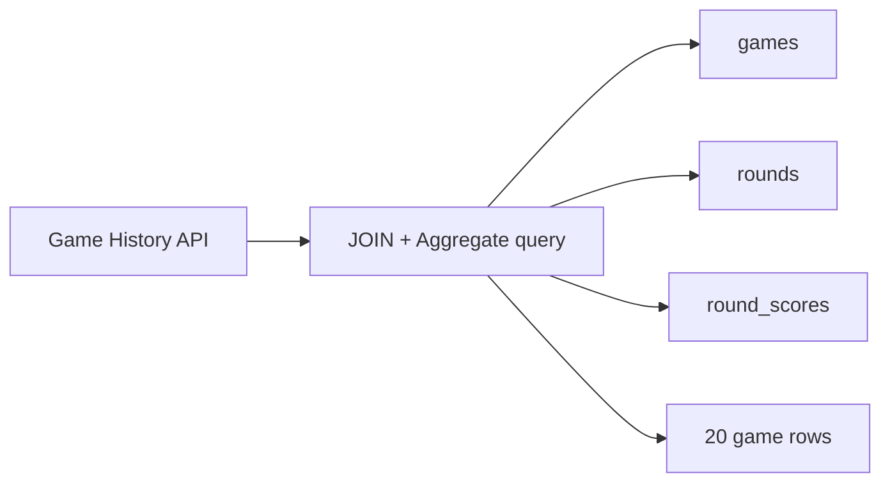
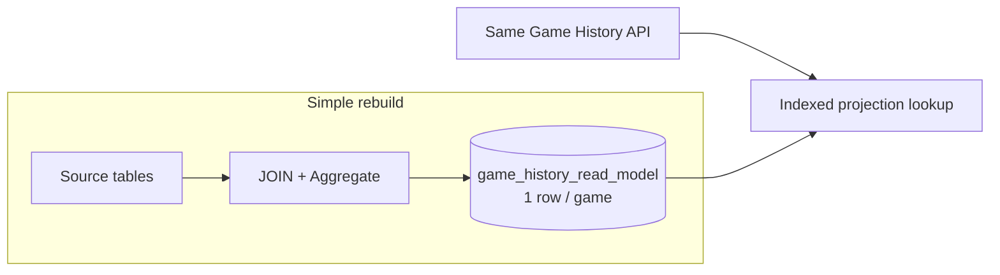
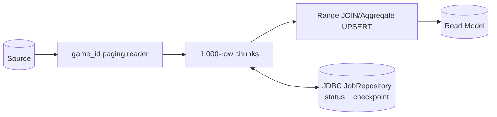
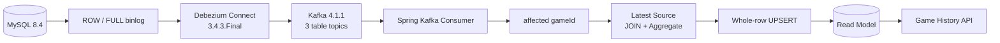
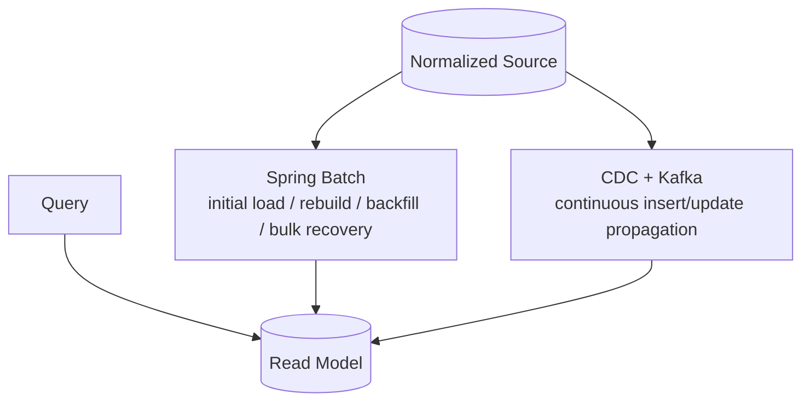

# Game History Read Model Lab — Final Technical Comparison

## Executive Summary

이 프로젝트는 `Original JOIN → Read Model → Spring Batch → Incremental Batch → CDC + Kafka`를 처음부터 정답으로 정해 놓고 구현한 로드맵이 아니다. 각 단계에서 직전 구조의 한계를 코드와 실패 실험으로 확인한 뒤, 그 한계를 해결하는 최소 구조를 다음 실험으로 선택했다.

1M games, 3.6M rounds, 6.9M round scores에서 Original JOIN은 최종 20 rows를 반환하기 전에 3개월 범위의 177,689 joined rows를 집계하고 요청당 289,842 rows를 읽었다. game당 1 row Read Model은 이 JOIN/Aggregate를 request path에서 제거해 같은 Stage 2 환경의 3개월 page 0 p95를 6,245.20–10,861.08ms에서 6.96–10.49ms로 낮췄다. 그러나 projection은 스스로 만들어지거나 최신 상태를 유지하지 않았고, 실패·재처리·freshness라는 새로운 운영 문제가 생겼다.

Spring Batch는 조회를 더 빠르게 만드는 기술이 아니라 1M bulk 작업의 상태, checkpoint, restart, bounded backfill을 관리하기 위해 도입했다. 그다음 바로 Kafka로 가지 않고 Incremental Batch를 측정한 결과, 이 프로젝트의 sparse workload에서는 5–10분 freshness가 충분히 가능했다. 정상 상황 수 초 이내라는 더 강한 요구를 적용한 뒤에야, 1분 polling의 약 59초 lag와 41.7% empty runs를 근거로 CDC + Kafka의 추가 복잡성이 정당화됐다.

최종 책임은 경쟁이 아니라 분리다. Query는 Read Model, bulk/rebuild/recovery는 Spring Batch, 지속적인 insert/update propagation은 CDC + Kafka가 맡는다. 이 결론은 로컬 비교 실험의 결과이며 production capacity나 보편적인 industry rule을 의미하지 않는다.

## Evidence Boundary

모든 수치는 Apple M1 8-core/16GB 노트북의 로컬 Docker 환경에서 얻었다. Stage 1–2 HTTP benchmark는 같은 호스트의 k6, Spring Boot application, MySQL을 사용했고, Stage 4의 cadence는 한 시간의 logical timeline을 제어해 계산했으며, Stage 5 freshness는 Source SQL client 완료부터 projection 관찰까지 실제 clock으로 측정했다. 따라서 단계 내부의 비교와 구조적 차이를 판단하는 근거로 사용하되, 서로 다른 방식의 수치를 완전히 동일한 부하 시험처럼 취급하거나 운영 환경으로 일반화하지 않는다.

주요 근거 문서와 retained run은 다음과 같다.

- [Stage 1 experiment](experiments/stage1-original-join.md), [HTTP summary](../benchmarks/stage1/results/20260810T122400Z/http-summary.tsv)
- [Stage 2 experiment](experiments/stage2-read-model.md), [HTTP summary](../benchmarks/stage2/results/20260812T100300Z/http-summary.tsv)
- [Stage 3 experiment](experiments/stage3-batch-recovery.md), [operational comparison](../benchmarks/stage3/results/20260812T111000Z/summarized/comparison.tsv)
- [Stage 4 experiment](experiments/stage4-incremental-freshness.md), [cadence summary](../benchmarks/stage4/results/20260812T124000Z/summarized/cadence-summary.tsv)
- [Stage 5 experiment](experiments/stage5-cdc-kafka.md), [freshness summary](../benchmarks/stage5/results/20260813T124200Z/summarized/freshness-summary.tsv)
- [Batch → CDC handoff](experiments/batch-cdc-handoff.md), [ordering comparison](../benchmarks/handoff/results/20260901T1425Z/summary.tsv)

## Architecture Evolution

초기에는 continuous CDC를 다음 후보 단계로 검토했지만, 실제 구현에서는 그 전에 periodic polling의 충분성과 한계를 확인하는 Incremental Batch 실험을 Stage 4로 삽입했고 CDC를 Stage 5로 진행했다. 아래 순서는 이 최종 실험 번호를 따른다. 즉 후보 기술을 그대로 도입한 것이 아니라 freshness requirement를 한 단계 더 검증한 결과다.

## Stage 1 — Original JOIN

### 당시 구조



### 확인한 문제

정규화된 Source는 쓰기 모델로는 단순했지만, 대표 조회가 실행될 때마다 `games → rounds → round_scores`를 LEFT JOIN하고 `SUM(score)`, `COUNT(DISTINCT round)`를 계산해야 했다. 기존 Source index는 shop/time range와 child lookup을 지원해 full games-table scan은 피했지만, 넓은 기간의 child-row multiplication과 aggregate/sort는 피하지 못했다.

### 선택

조회 계약을 바꾸거나 Source query를 튜닝하기 전에, API가 필요한 여덟 필드를 game당 1 row로 미리 계산하는 Read Model을 다음 실험으로 선택했다. 목적은 request-time JOIN/Aggregate 자체를 제거했을 때의 차이를 측정하는 것이었다.

### 근거

Seed `20260810`의 실제 규모는 1,000,000 games, 3,600,000 rounds, 6,900,000 round scores였다. popular shop의 대표 결과는 다음과 같다.

| Query | p95 pass 1 / pass 2 | Throughput pass 1 / pass 2 | Rows read/request |
| --- | ---: | ---: | ---: |
| 7일, page 0 | 853.60 / 789.24ms | 5.946 / 6.029 req/s | 22,045 |
| 3개월, page 0 | 6,424.08 / 4,685.38ms | 0.845 / 0.890 req/s | 289,842 |
| 3개월, page 100 | 6,784.37 / 7,526.99ms | 0.770 / 0.706 req/s | 289,842 |

3개월 실행 계획은 25,205 games를 91,993 Game/Round rows, 다시 177,689 RoundScore-joined rows로 확장한 뒤 25,205 games를 집계했다. page 0은 그중 20 rows, page 100은 정렬 결과 2,020 rows를 유지한 뒤 20 rows만 반환했다. Traditional EXPLAIN에는 `Using temporary; Using filesort`가 기록됐고, EXPLAIN ANALYZE는 page 0 2,695ms, page 100 3,133ms였다.

### 해결된 것

이 단계는 해결책을 구현한 단계가 아니라, 1M 규모만으로 request-time JOIN/Aggregate 병목을 재현하고 이후 비교 기준을 고정했다. 더 큰 데이터셋을 만들 필요가 없다는 근거도 확보했다.

### 남은 문제

기간이 넓어질수록 최종 반환량과 무관한 child lookup, aggregate, temporary, sort 비용이 매 요청 반복됐다. 이 문제는 Stage 2에서 계산 시점을 request time 밖으로 옮길 이유가 됐다.

## Stage 2 — one-row-per-game Read Model

### 당시 구조



### 확인한 문제

Stage 1의 병목은 Source가 없어서가 아니라 API가 필요한 aggregate를 요청마다 다시 계산해서 발생했다. 같은 `[from, to)`, `playedAt DESC, gameId DESC`, page/size, 여덟 필드의 의미를 유지하면서 계산을 build time으로 이동할 필요가 있었다.

### 선택

`game_id`를 PK로 하고 `(shop_id, played_at DESC, game_id DESC)`를 secondary index로 둔 projection을 만들었다. 최초 baseline은 framework 없이 `TRUNCATE → INSERT ... SELECT` 한 번으로 전체 Source를 materialize했다. Stage 2의 목적은 먼저 조회 구조의 효과를 격리하는 것이므로 Spring Batch는 아직 넣지 않았다.

### 근거

Stage 1 수치를 재사용하지 않고 같은 Stage 2 jar/DB에서 Original과 Read Model을 각각 두 pass로 재측정했다. 총 2,400 measured requests의 error는 0이었다.

| Query | Original p95 | Read Model p95 | Original throughput | Read Model throughput | Rows read: Original → RM |
| --- | ---: | ---: | ---: | ---: | ---: |
| 7일, page 0 | 681.74 / 1,020.96ms | 3.77 / 10.46ms | 6.674 / 5.466 req/s | 1,376.42 / 614.59 req/s | 22,045 → 20 |
| 3개월, page 0 | 10,861.08 / 6,245.20ms | 10.49 / 6.96ms | 0.593 / 0.796 req/s | 636.39 / 914.21 req/s | 289,842 → 20 |
| 3개월, page 100 | 8,746.66 / 9,700.80ms | 27.54 / 23.58ms | 0.589 / 0.641 req/s | 209.06 / 220.81 req/s | 289,842 → 2,020 |

Original plan은 여전히 네 table, 177,689 joined rows, aggregate, temporary, filesort를 사용했다. Read Model plan은 `idx_game_history_shop_played_at`의 단일 ordered range scan이었고 request-time JOIN, aggregate, temporary, filesort가 없었다. EXPLAIN ANALYZE에서 3개월 page 0은 Original 2,340ms 대 Read Model 0.360ms, page 100은 1,882ms 대 12.6ms였다. page 100의 2,020-row offset traversal은 남았지만 child-row multiplication은 제거됐다.

실제 1M Source projection의 누락·extra·필드 mismatch와 세 대표 page 차이는 모두 0이었다. Stage 2 experiment narrative에 기록된 SQL build 세 관찰은 25.3001–42.2492초였다. 이 timing은 Stage 2 raw result directory가 아니라 당시 실험 기록에 보존된 값이므로 새로 재구성하지 않았다.

### 해결된 것

요청 경로가 `Source JOIN/Aggregate`에서 `이미 계산된 projection의 ordered index lookup`으로 바뀌었다. API 의미를 바꾸지 않고 최종 조회 비용을 반환 전 index traversal에 가깝게 줄였다.

### 남은 문제

projection은 새로운 운영 책임을 만들었다.

- measured rebuild의 `TRUNCATE` 이후 반복 probe에서 0 rows가 관찰됐고, 해당 SQL build는 26.9366초에 commit됐다.
- 의도적 SQL 실패는 exit 1과 0-row projection을 남겼다.
- 실행 상태, 실패 위치, checkpoint가 없고 recovery는 전체 rebuild였다.
- bounded backfill 입력이 없었다.
- Source insert/status/score 변경을 지속적으로 반영하는 경로가 없었다.

설계서의 과거/당일 API merge는 이 focused experiment에서 구현하거나 측정하지 않았다. Stage 3의 직접 근거는 실제로 확인한 rebuild/recovery/backfill 문제다.

## Stage 3 — Spring Batch for Bulk Recovery

### 당시 구조



### 확인한 문제

한 번의 set-based SQL은 단순하지만 실패 시 committed progress, failure position, restart boundary를 알 수 없었다. 1M 전체가 아닌 일부만 고치려 해도 실행 가능한 bounded 입력이 없었다.

### 선택

Spring Batch 6.0.4의 JDBC JobRepository, `JdbcPagingItemReader`, chunk transaction만 사용했다. chunk size는 1,000이고 unique `game_id`를 checkpoint로 저장한다. 각 chunk는 같은 projection 의미로 range UPSERT하며 `runId/mode/min/max`가 JobInstance를 식별한다. scheduler, retry policy, partitioning, admin UI는 추가하지 않았다.

### 근거

`gameId=250001`에서 의도적으로 실패시킨 실제 1M run은 다음 상태를 남겼다.

- FAILED Job/Step: read 251,000, write 250,000, commit 250, rollback 1
- ExecutionContext checkpoint: `id=250000`
- failure 직후 Read Model: 정확히 250,000 rows의 committed prefix
- 같은 JobInstance restart: 남은 750,000 rows만 read/write, status `COMPLETED`
- restart 후 1,000,000 rows, missing/extra/field mismatch 0

IDs 400,001–410,000의 10,000-row bounded backfill은 10,000 rows만 read/write했고 11 commits, rollback 0이었다. 대상 밖 checksum은 변하지 않았고 최종 exhaustive equality가 통과했다.

Simple SQL과 Batch의 한 번의 순차 측정은 각각 385.5919 SQL seconds와 312.2380 JobExecution seconds였다. host/cache/order를 통제한 성능 benchmark가 아니므로 이 차이는 Spring Batch의 성능 우위 근거로 사용하지 않는다.

### 해결된 것

Spring Batch는 Read Model query를 빠르게 만들지 않았다. 대신 initial load, full rebuild, same-instance restart, bounded backfill, bulk recovery의 상태와 절차를 관리 가능하게 만들었다.

### 남은 문제

Batch UPSERT는 기존 row를 유지하므로 simple `TRUNCATE`보다 rebuild 중 0 rows 노출을 줄이지만, 빈 table 최초 적재는 여전히 partial하게 보인다. chunk 전체에 하나의 Source snapshot이 없고, Source에서 삭제된 game의 stale projection도 자동 제거하지 않는다. 무엇보다 bulk job이 끝나는 즉시 이후 Source 변경으로 projection은 다시 오래되기 시작했다. 이 freshness 문제가 Stage 4의 입력이 됐다.

## Stage 4 — Periodic Incremental Batch

### 당시 구조

```mermaid
flowchart LR
    G[games.updated_at] --> U[Tuple-ordered UNION]
    R[rounds.updated_at] --> U
    RS[round_scores.updated_at] --> U
    U --> IDs[affected gameIds]
    IDs --> P[Latest Source projection UPSERT]
    P --> RM[(Read Model)]
    U <--> C[(updated_at, game_id) checkpoint]
```

### 확인한 문제

full rebuild/restart는 관리 가능해졌지만, 소수 변경 때문에 1M 전체를 반복 처리하는 것은 불필요했다. 아직 실제 freshness requirement별로 polling이 충분한 범위와 비용을 측정하지 않았으므로 Kafka를 바로 도입할 근거도 없었다.

### 선택

`games`, `rounds`, `round_scores`의 변경을 `(updated_at, game_id)` tuple로 읽고 affected game만 최신 Source에서 다시 계산해 UPSERT하는 explicit incremental Batch command를 만들었다. 동일 timestamp 경계는 game ID로 결정성을 확보하고, 5분 overlap은 최근 변경을 의도적으로 replay한다. projection write와 reader checkpoint는 chunk transaction으로 commit되고, durable next-run cursor는 processing step 전체 성공 후에만 전진한다.

### 근거

동일한 sparse eight-game workload를 한 시간 logical timeline에서 네 cadence로 비교했다. `Changes read`는 실제 business change 수가 아니라 초기 replay와 overlap replay를 포함한다.

| Cadence | Freshness lag range | Executions/hour | Changes read | MySQL Questions | Empty runs |
| --- | ---: | ---: | ---: | ---: | ---: |
| 60분 | 659.252–3,599.252s | 1 | 8 | 273 | 0/1 (0%) |
| 10분 | 61.333–599.351s | 6 | 17 | 1,660 | 0/6 (0%) |
| 5분 | 59.535–299.323s | 12 | 29 | 3,330 | 2/12 (16.7%) |
| 1분 | 59.254–59.395s | 60 | 90 | 16,537 | 25/60 (41.7%) |

이 freshness는 실제 한 시간을 기다린 값이 아니라 `다음 logical tick까지의 wait + 실제 JobExecution duration`이다. 이벤트를 minute boundary 1초 뒤에 배치했기 때문에 1분 samples가 약 59초이며, 임의 도착의 보편적인 latency distribution은 아니다.

경계 실험은 같은 timestamp에서 cursor game ID 뒤의 두 games를 모두 읽었다. chunk size 2의 failure 실험은 read 6, write 4, commit 2, rollback 1로 실패했고 durable cursor는 전진하지 않았다. 같은 JobInstance restart는 남은 네 items를 처리했으며 mismatch 0, cursor advance를 확인했다. 이미 반영한 변경 replay의 checksum은 전후 `15319432641`로 같았다.

### 해결된 것

신규 game, status, score 변경을 full rebuild 없이 affected game 범위로 수렴시켰다. 같은 timestamp, failure/restart, overlap replay에서 누락·중복으로 projection이 왜곡되지 않음을 확인했다. 이 workload에서 5–10분 수준이라면 Incremental Batch가 충분하다는 조건부 결론을 얻었다.

### 남은 문제

1분 cadence는 60회 기동 중 25회가 비었고, 여덟 unique changed games에 overlap을 포함해 90 rows를 읽고 16,537 Questions를 발생시켰다. arbitrary arrival은 cadence만큼 기다릴 수 있으며, 5분 overlap보다 오래 열린 transaction은 cursor 뒤의 `updated_at`으로 commit되어 누락될 수 있다. 따라서 Incremental Batch가 실패한 것이 아니라, strict sub-minute/안정적인 1분 이내 요구에서 polling model의 비용과 경계가 드러났다.

## Stage 5 — CDC + Kafka

### 당시 구조



### 확인한 문제

새 요구는 정상 상황 수 초 이내 반영이었다. Stage 4의 5–10분 결과로는 이 요구를 만족할 수 없고, polling cadence를 더 줄이면 이미 확인한 empty run, Batch metadata, overlap replay, Source query 비용을 더 늘려야 했다.

### 선택

MySQL row binlog를 Debezium이 읽어 `games`, `rounds`, `round_scores`의 세 one-partition topics로 전달하고, 한 consumer가 affected game ID만 식별하도록 했다.

- `games` → captured `id`
- `rounds` → captured `game_id`
- `round_scores` → captured `round_id`로 현재 `rounds.game_id` 조회

CDC payload 값을 projection row로 직접 변환하지 않았다. event는 “어느 game을 다시 계산할지”만 알려 주고, consumer는 최신 Source의 같은 `LEFT JOIN/SUM/COUNT(DISTINCT)` projection을 계산해 whole-row UPSERT한다. Stage 4 Incremental Batch와 CDC consumer가 `GameHistoryProjectionUpdater`를 공유하므로 transport가 달라도 최종 row 의미는 같다.

Consumer는 JDBC transaction 안에서 projection을 쓰고 `AckMode.RECORD`를 사용한다. DB transaction commit 뒤 listener가 성공 반환하면 offset이 commit된다. 두 시스템의 atomic commit이나 exactly-once는 아니며, DB commit 뒤 offset commit 전에 실패하면 replay될 수 있다. whole-row UPSERT가 그 replay를 안전하게 수렴시킨다.

### 근거

20개 순차 status changes의 client-observed commit 완료 → projection visibility 결과는 다음과 같았다.

| Samples | p50 | p95 | Max | Missing/error |
| ---: | ---: | ---: | ---: | ---: |
| 20 | 395ms | 450ms | 468ms | 0 |

신규 game, status, round, score 변경과 same-game rapid update 모두 실제 MySQL → Debezium → Kafka → consumer 경로를 통과했고, 최종 1,000,002 Source/Read Model rows의 여덟 필드와 대표 pages가 일치했다.

10초 idle window의 global MySQL Questions delta는 6이었다. 이는 periodic change-discovery job이 없다는 보조 근거이지 Source cost가 0이라는 뜻은 아니다. binlog/replication connection은 유지되고 각 event마다 최신 Source를 재조회한다. Stage 4의 16,537 Questions는 한 시간 logical profile이고 Stage 5의 6은 10초 real idle window이므로 절대량을 동등-duration cost로 직접 비교하지 않는다.

Corrected `earliest` replay group은 31 records를 실제 처리하고 lag 0에 도달했다. 두 workload rows의 checksum은 전후 `3287816278`로 같았다. Consumer failure는 Source `IN_PROGRESS`에 대해 projection을 이전 `COMPLETED`로 남기고 game-topic offset 25 / log-end 26 / lag 1을 만들었다. 같은 group restart는 record를 다시 처리해 projection을 `IN_PROGRESS`, offset 26, lag 0으로 수렴시켰다.

### 해결된 것

정상 local 조건에서 periodic change-discovery polling 없이 seconds-level insert/update propagation을 달성했다. 중복 전달과 consumer restart가 같은 projection 의미로 최종 수렴했고, API는 하나의 Read Model을 기본 조회 경로로 사용할 수 있게 됐다.

### 남은 문제

Kafka/Connect는 binlog, replication user, connector/task, topics, offsets, rebalances, process restart라는 운영 비용을 추가했다. `snapshot.mode=no_data`이므로 Batch 완료와 connector 시작 사이 handoff gap을 자동 해결하지 않는다. physical delete, re-parent, poison message, retry/DLQ, Kafka/Connect local state persistence, atomic rebuild publication도 해결하지 않았다. 따라서 CDC + Kafka는 seconds-level 요구에서는 정당화됐지만 모든 freshness 요구의 기본 정답은 아니다.

## 핵심 비교표

| 단계 | 당시 문제 | 선택 | 실제 근거 | 해결된 것 | 새 비용/문제 |
| --- | --- | --- | --- | --- | --- |
| Original JOIN | 요청마다 child JOIN/Aggregate | 먼저 baseline 유지·측정 | 3개월 p95 4.69–7.53s; 177,689 joined rows; 289,842 reads/request | 병목과 비교 기준 확인 | 기간이 넓을수록 반복 비용 |
| Read Model | request-time 계산 비용 | game당 1 row + ordered index | 3개월 page 0 p95 6.96–10.49ms; 20 rows read | JOIN/Aggregate를 request path에서 제거 | rebuild, 0-row failure, stale data |
| Spring Batch | opaque full rebuild와 recovery | JDBC JobRepository + 1,000-row chunks | 250,001 failure, 250k commit, 750k restart, mismatch 0 | bulk 상태/restart/10k backfill | metadata/configuration, partial publication, freshness 미해결 |
| Incremental Batch | bulk 완료 직후 stale | tuple cursor + overlap + affected-ID UPSERT | 5–10분 수렴; 1분 60 runs, 41.7% empty, 16,537 Questions | minute-level 변경 반영 | 짧은 cadence polling/replay 비용, long-tx gap |
| CDC + Kafka | seconds-level 요구 | binlog CDC + affected-ID consumer | p50/p95/max 395/450/468ms; 31-record replay; failure lag 1→0 | 지속적인 insert/update propagation | broker/Connect/offset/handoff/retry/delete 운영 |

## Freshness에 따른 선택 기준

이 선택 기준은 이 프로젝트의 sparse workload와 로컬 환경에서 얻은 조건부 결론이다.

| 요구 | 이 프로젝트에서 적합했던 경로 | 근거와 한계 |
| --- | --- | --- |
| initial load, full rebuild, bounded repair, bulk recovery | Spring Batch | freshness scheduler가 아니라 durable state/checkpoint/restart 문제를 해결 |
| 5–10분 수준 변경 반영 | Incremental Batch | affected rows만 처리하고 모든 cadence correctness 통과; polling과 overlap 비용은 감수 |
| 안정적인 1분 이내 또는 seconds-level 정상 반영 | CDC + Kafka 검토/도입 | 1분 Batch는 약 59초 및 41.7% empty; CDC local p95 450ms, missing 0 |

5–10분 요구라면 Kafka/Connect의 지속 운영 비용을 추가할 필요가 없다는 것이 Stage 4의 결론이다. seconds-level 요구가 실제로 선택됐을 때만 Stage 5의 복잡성이 현재 workload에서 정당화됐다.

## 최종 책임 분리



- **Query = Read Model**: 동일 API 계약을 한 table의 ordered index lookup으로 제공한다.
- **Bulk = Spring Batch**: initial load, full rebuild, bounded backfill, bulk recovery와 checkpoint를 담당한다.
- **Change = CDC + Kafka**: Batch-to-CDC handoff 이후 지속적인 신규/수정 변경을 전달한다.

Batch와 CDC는 같은 문제의 경쟁 해법이 아니다. Batch가 한 번에 많은 projection을 만들고 복구하는 책임을 맡고, CDC가 그 이후의 작은 변화 흐름을 맡으면 “1M rebuild를 자주 실행하는 것”과 “Kafka로 1M을 초기 적재하는 것”을 모두 피할 수 있다. 두 경로가 최신 Source를 재조회해 같은 projection 의미로 UPSERT하므로 query model의 정의도 transport마다 갈라지지 않는다.

## Failure / Recovery Evidence

| Experiment | Failure | Observed behavior | Recovery | Final correctness |
| --- | --- | --- | --- | --- |
| Simple Read Model rebuild | `TRUNCATE` 뒤 의도적 SQL failure | exit 1, Read Model 0 rows, run state/checkpoint 없음 | 전체 rebuild 재실행; recovery SQL 25.3001s, full command 88.19s | 1M equality 통과 |
| Spring Batch mid-job | game 250,001에서 exception | FAILED; 250k committed prefix; read 251k/write 250k/rollback 1; checkpoint 250k | 같은 JobInstance로 남은 750k restart | missing/extra/mismatch 0 |
| Incremental Batch | 8 changes 중 여섯 번째 read에서 failure | read 6/write 4/commit 2/rollback 1; 4 mismatch; durable cursor 불변 | 같은 JobInstance가 나머지 4 처리 후 cursor 전진 | workload mismatch 0, full equality 통과 |
| Incremental replay | 이미 반영한 game 재처리 | one affected game을 다시 Source projection UPSERT | 별도 복구 불필요 | checksum `15319432641` 전후 동일 |
| Kafka duplicate/replay | fresh `earliest` group으로 retained records replay | 31 records applied, final group lag 0 | idempotent whole-row UPSERT | checksum `3287816278` 전후 동일 |
| Kafka consumer failure | UPSERT 뒤 listener exception | JDBC rollback; Source `IN_PROGRESS`, projection `COMPLETED`; offset 25/log-end 26/lag 1 | 같은 group process restart 및 redelivery | projection `IN_PROGRESS`; offset 26/lag 0; full equality 통과 |
| Batch → CDC handoff | Batch 뒤 `no_data` Connector 시작 | Source `CANCELLED`, projection `COMPLETED`; mismatch 1 | Connector START barrier → Batch → Consumer catch-up | one-partition target offset 2, lag 0, 1,000 rows equality |

이 표는 “장애를 고려했다”는 설계 주장이 아니라 retained raw logs에서 실제로 실패시키고 관찰한 범위다. 다만 atomic rebuild publication, broker outage, poison-message loop 같은 장애는 실행하지 않았다.

## What We Did NOT Choose

| 기술/구조 | 이번 프로젝트에서 추가하지 않은 이유 |
| --- | --- |
| Redis | Read Model index lookup만으로 조회 병목이 충분히 제거됐다. cache consistency라는 새 문제를 추가할 측정 근거가 없었다. |
| Transactional Outbox | application business event publish를 만들지 않고 MySQL binlog CDC를 검증했다. Outbox가 필요한 별도 event-contract/dual-write 문제는 실험하지 않았다. |
| Versioned Read Model / shadow swap | rebuild의 partial visibility는 남아 있지만 Stage 3의 bulk restart와 Stage 5 freshness 질문과는 별도 문제다. atomic publication 요구가 확정되지 않았다. |
| Debezium data snapshot | Batch가 initial load를 담당하므로 `no_data`를 유지했다. Connector-first catch-up은 로컬 단일 partition에서 검증했고, 운영용 partition별 경계 영속화는 별도 과제로 남겼다. |
| Complex retry/DLQ | 기본 failure-stop과 same-group redelivery를 먼저 확인했다. poison-message 정책 요구 없이 framework를 선행하지 않았다. |
| Kubernetes / multi-broker Kafka | 로컬 구조·correctness·freshness 비교가 목적이었다. 배포, HA, capacity 문제를 측정하지 않았다. |

이 선택은 해당 기술의 일반적 장단점에 대한 평가가 아니다. 현재 확인한 문제를 해결하는 데 필요하지 않은 복잡성을 보류한 것이다.

## Remaining Problems

| 문제 | 현재 영향 | 아직 해결하지 않은 이유 | 다음 실험 조건 |
| --- | --- | --- | --- |
| Physical delete semantics | UPSERT-only projection에 stale row가 남을 수 있음 | Source의 delete/soft-delete 계약 자체가 없음 | 삭제를 대표 API에 반영해야 하는 business rule이 정해질 때 |
| Re-parent semantics | round의 old/new game 양쪽 projection을 갱신하지 않을 수 있음 | 현재 workload에 관계 이동이 없음 | round 이동이 허용되고 correctness 사례가 생길 때 |
| Poison message | stopping error handler 때문에 수동 restart가 필요하고 동일 record가 반복 실패할 수 있음 | retry/DLQ 정책을 선행하지 않음 | 자동 recovery 시간과 격리 정책이 요구될 때 |
| Retry/DLQ operation | 장기 failure가 consumer progress를 막음 | 한 번의 deterministic redelivery까지만 검증 | retry budget, alerting, manual replay 기준이 필요할 때 |
| Atomic rebuild publication | 최초 적재는 partial하고 chunk들은 한 Source snapshot을 공유하지 않음 | Versioned/shadow model은 별도 저장·전환 복잡성 | readers가 완전한 단일 version만 보아야 할 때 |
| Local Kafka/Connect persistence | container recreation 시 broker records와 offsets 소실 | resettable local lab 범위 | 장기 실행, 장애 복구, 재기동 내구성을 검증할 때 |

## Final Conclusion

Read Model이 필요했던 이유는 단순히 table을 하나 더 두기 위해서가 아니다. 1M Source에서 20 rows를 반환하려고 최대 177,689 joined rows를 집계하고 요청당 289,842 rows를 읽는 request-time 비용이 실제 multi-second p95 병목으로 확인됐기 때문이다. game당 1 row projection은 같은 API semantics를 유지하면서 그 비용을 ordered index lookup으로 바꿨다.

Spring Batch가 필요했던 이유도 query performance가 아니다. projection을 도입하자 initial load, rebuild, 실패 위치, restart, bounded backfill이라는 운영 문제가 생겼고, 250,001 failure와 250,000 committed rows, 750,000-row restart 실험으로 JDBC JobRepository와 checkpoint의 가치가 확인됐다. Simple SQL보다 Batch가 빠르다는 결론은 단일 timing으로 내리지 않았다.

바로 Kafka를 사용하지 않은 이유는 freshness 요구가 기술 선택보다 먼저여야 했기 때문이다. Incremental Batch는 신규/수정 변경, 동일 timestamp, replay, failure/restart에서 정확히 수렴했고, 이 workload의 5–10분 요구에는 충분했다. strict 1분 이하에서 약 59초 wait, 41.7% empty runs, 증가한 polling/metadata 비용을 측정한 뒤에야 CDC 후보를 검토할 근거가 생겼다.

seconds-level 요구를 적용한 Stage 5에서는 CDC가 정상 local 조건에서 p95 450ms, max 468ms, missing 0으로 반영했고, replay와 consumer failure/restart도 최종 Source 상태로 수렴했다. 그 대신 Kafka/Connect/offset/handoff/retry/delete라는 운영 복잡성을 받아들였다. 따라서 CDC + Kafka는 최종 정답이라서가 아니라 이 freshness 요구에서만 비용이 정당화된 선택이다.

최종 책임은 `Query = Read Model`, `Bulk = Batch`, `Change = CDC`다. Bulk와 continuous change를 분리하고 두 경로가 동일한 latest-Source projection을 사용함으로써, 조회 계약은 하나로 유지하면서 대량 복구와 지속 변경 반영을 서로 다른 실행 모델에 맡겼다. 이것이 Stage 1~5의 실험에서 도출된 최종 기술적 결론이다.
